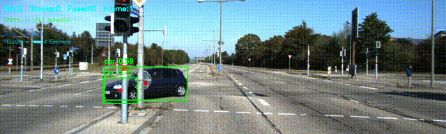
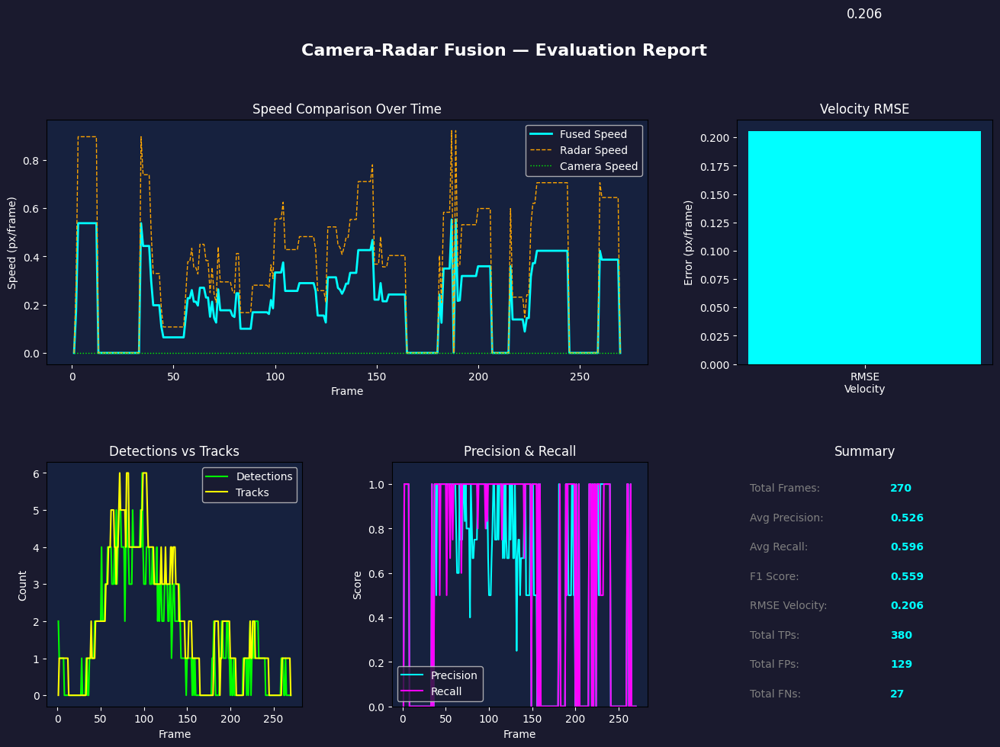
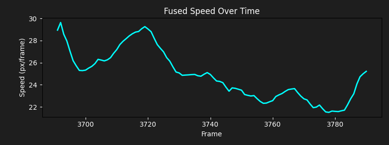

# 🚗 Camera–Radar Sensor Fusion for Real-Time Object Detection


A real-time multi-sensor perception pipeline that combines **YOLOv8 object detection** with **DeepSORT tracking**, **Kalman Filter state estimation**, and **simulated radar fusion** — replicating a simplified ADAS (Advanced Driver Assistance System) perception stack evaluated on the KITTI benchmark dataset.

---

## 📽️ Demo

> Full pipeline running on KITTI sequence 0006 — real autonomous driving footage



---

## 🧠 System Architecture

```text
┌─────────────────┐     ┌──────────────────────┐
│  Camera Frame   │────▶│   YOLOv8 Detector    │
│  (KITTI / Cam)  │     │  Bounding Boxes +     │
└─────────────────┘     │  Class + Confidence   │
                        └──────────┬───────────┘
                                   │
                        ┌──────────▼───────────┐
                        │   DeepSORT Tracker   │
                        │  Persistent IDs +    │
                        │  Re-identification   │
                        └──────────┬───────────┘
                                   │
┌─────────────────┐     ┌──────────▼───────────┐
│ Radar Simulator │────▶│    Sensor Fusion     │
│  Range + Radial │     │  Kalman Filter       │
│  Velocity +     │     │  Camera + Radar      │
│  Gaussian Noise │     │  Weighted Update     │
└─────────────────┘     └──────────┬───────────┘
                                   │
                        ┌──────────▼───────────┐
                        │     Evaluation       │
                        │  Precision / Recall  │
                        │  F1 Score / RMSE     │
                        │  5-Panel Report      │
                        └──────────────────────┘
```

---

## ✨ Features

- **YOLOv8n** real-time object detection — person, car, truck, bus, motorcycle
- **DeepSORT** multi-object tracking with persistent IDs across occlusions
- **Kalman Filter** state estimation using constant velocity motion model
- **Radar Simulation** with configurable Gaussian noise on range and radial velocity
- **Sensor Fusion** — confidence-weighted camera + radar Kalman update step
- **KITTI Dataset** support — real autonomous driving benchmark evaluation
- **Evaluation Metrics** — Precision, Recall, F1 Score, RMSE per frame
- **5-panel evaluation report** auto-saved on exit
- **Live velocity plot** updated in real time during inference
- **Output video** saved to `outputs/tracked_output.mp4`

---

## 📐 State-Space Model

**State vector tracked per object:**

```text
X = [x,  y,  vx,  vy]ᵀ
     pos     velocity
```

**Constant velocity motion model:**

```text
X_k = A · X_(k-1) + w_k

    | 1  0  dt  0 |
A = | 0  1  0  dt |
    | 0  0  1   0 |
    | 0  0  0   1 |

dt = time between frames (~0.033s at 30fps)
w_k = process noise
```

**Measurement sources:**

| Sensor            | Measurement                 | Noise Model              -|
|-------------------|-----------------------------| --------------------------|
| Camera (YOLO)     | position (x, y)             | Gaussian σ = 10 px        |
| Radar (simulated) | range r, radial velocity v  | Gaussian σ = 5.0, σ = 0.5 |

**Fusion update:**

```text
fused_vx = 0.4 × camera_vx  +  0.6 × radar_vx
fused_vy = 0.4 × camera_vy  +  0.6 × radar_vy
```

---

## 📁 Project Structure

```text
camera_radar_fusion/
│
├── main.py                     # Pipeline entry point
├── config.py                   # All configurable settings
├── requirements.txt            # Full dependency snapshot
├── requirements_clean.txt      # Minimal install dependencies
│
├── modules/
│   ├── detector.py             # YOLOv8 camera detection
│   ├── tracker.py              # Kalman Filter tracker (basic)
│   ├── deepsort_tracker.py     # DeepSORT tracker (upgraded)
│   ├── radar.py                # Radar simulator with Gaussian noise
│   └── fusion.py               # Sensor fusion logic
│
├── utils/
│   ├── metrics.py              # RMSE, Precision, Recall
│   ├── visualizer.py           # Live velocity plot
│   ├── evaluator.py            # Full 5-panel evaluation report
│   └── kitti_loader.py         # KITTI dataset loader
│
├── data/
│   └── kitti/                  # KITTI sequences (not tracked by Git)
│       ├── image_02/0006/      # 270 PNG frames
│       └── label_02/0006.txt   # Ground truth labels
│
└── outputs/
    ├── tracked_output.mp4      # Output demo video
    ├── evaluation_report.png   # 5-panel evaluation graph
    └── velocity_plot.png       # Fused speed over time
```

---

## 🚀 Installation

1. Clone the repository

    ```bash
    git clone https://github.com/rktiwarimt007/camera_radar_fusion
    cd camera-radar-fusion
    ```

2. Create virtual environment

    ```bash
    # Windows
    python -m venv venv
    venv\Scripts\activate

    # Linux / Mac
    python -m venv venv
    source venv/bin/activate
    ```

3. Install dependencies

    ```bash
    pip install -r requirements_clean.txt
    ```

---

## 📦 KITTI Dataset Setup

1. Download from 👉 [KITTI Tracking Benchmark](https://www.cvlibs.net/datasets/kitti/eval_tracking.php):
   - **Left color images** (tracking training set)
   - **Training labels**

2. Organize into:

    ```text
        data/kitti/image_02/0006/000000.png ...
        data/kitti/label_02/0006.txt
    ```

3. In `config.py` set:

    ```python
    USE_KITTI        = True
    KITTI_SEQUENCE   = "0006"
    ```

---

## ▶️ Usage

### Run on KITTI dataset

```bash
python main.py
```

### Run on webcam

In `config.py` set `USE_KITTI = False`, then:

```bash
python main.py
```

### Controls

| Key | Action                          |
|-----|---------------------------------|
| `q` | Quit and save evaluation report |

### Outputs saved automatically

```text
outputs/tracked_output.mp4       # annotated video
outputs/evaluation_report.png    # 5-panel metrics report
outputs/velocity_plot.png        # fused speed over time
```

---

## ⚙️ Configuration

All settings in `config.py`:

```python
# Detection
YOLO_MODEL            = "yolov8n.pt"     # n=fast, s/m=accurate
CONFIDENCE_THRESHOLD  = 0.5
TARGET_CLASSES        = [0, 2, 3, 5, 7]  # person, car, motorcycle, bus, truck

# Radar simulation
RADAR_MAX_RANGE       = 800              # pixels
RADAR_RANGE_NOISE     = 5.0              # Gaussian σ for range
RADAR_VELOCITY_NOISE  = 0.5             # Gaussian σ for velocity

# Fusion weights (must sum to 1.0)
FUSION_CAMERA_TRUST   = 0.4
FUSION_RADAR_TRUST    = 0.6

# Dataset
USE_KITTI             = True
KITTI_SEQUENCE        = "0006"
```

---

## 📊 Results

Evaluated on **KITTI Tracking Sequence 0006** (270 frames, real urban driving):

| Metric | Value |
|--------|-------|

| Total Frames | **270** |
| Avg Precision | **0.526** |
| Avg Recall | **0.596** |
| F1 Score | **0.559** |
| RMSE Velocity | **0.206 px/frame** |
| Total True Positives | **380** |
| Total False Positives | **129** |
| Total False Negatives | **27** |

> CPU inference only — YOLOv8n model — Windows 11

### Evaluation Report



### Fused Speed Over Time



---

## 🎨 Visualization Legend

| Color | Meaning |
|-------|---------|

| 🟩 Green box | Raw YOLO detection |
| 🔵 Blue dot + line | Simulated radar measurement |
| 🟡 Yellow ring | Sensor fusion active on object |
| Colored dot + trail | DeepSORT tracked object with history |
| Arrow | Estimated velocity direction |

---

## 🛣️ Roadmap

- [x] YOLOv8 real-time object detection
- [x] Kalman Filter state estimation
- [x] Simulated radar with Gaussian noise
- [x] Camera–radar sensor fusion
- [x] DeepSORT multi-object tracking
- [x] KITTI benchmark dataset support
- [x] Precision / Recall / F1 / RMSE evaluation
- [x] 5-panel evaluation report
- [ ] Hungarian algorithm for better assignment
- [ ] 3D bounding box estimation
- [ ] Real radar data integration (KITTI raw)
- [ ] Edge deployment on Jetson Nano / Raspberry Pi

---

## 🧰 Tech Stack

| Library | Version | Purpose |
|---------|---------|---------|

| ultralytics | 8.4.18 | YOLOv8 object detection |
| deep-sort-realtime | 1.3.2 | Multi-object tracking |
| filterpy | 1.4.5 | Kalman Filter |
| opencv-python | 4.13.0 | Video I/O + visualization |
| matplotlib | 3.10.8 | Evaluation graphs |
| numpy | 2.4.2 | Matrix operations |
| torch | 2.10.0 | Deep learning backend |

---

## 👤 Author

Rahul Kumar Tiwari

Built as a portfolio project demonstrating a complete ADAS perception stack — covering deep learning, probabilistic state estimation, sensor fusion, and real-world benchmark evaluation.

---

## 📄 License

This project is licensed under the **MIT License** — free to use, modify and distribute.

---

## ⭐ If this project helped you, please give it a star
